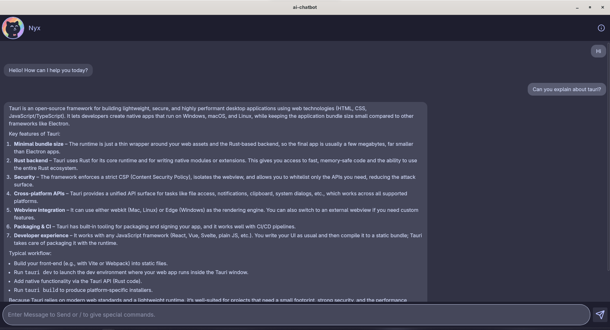
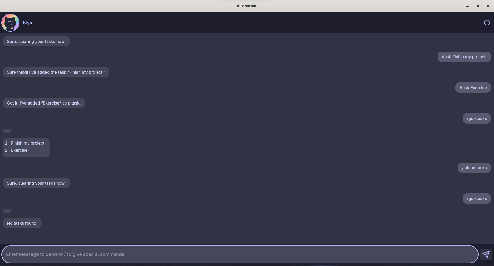

# AI Chat Assistant

A modern desktop AI chat application built with Tauri, featuring task management and real-time weather integration.

## ✨ Features

- **🤖 AI-Powered Chat** - Intelligent conversational assistant with context awareness
- **📝 Task Management** - Create, view, and manage tasks directly from chat
- **🌤️ Weather Integration** - Real-time weather data for any city worldwide
- **🎨 Beautiful UI** - Catppuccin Mocha theme with smooth animations
- **📱 Responsive Design** - Optimized for various screen sizes
- **⚡ Fast & Lightweight** - Built with Rust backend for optimal performance
- **💾 Persistent Storage** - Tasks saved locally with JSON file system

## 🛠️ Tech Stack

- **Frontend:** React, TypeScript, Tailwind CSS
- **Backend:** Rust, Tauri
- **APIs:** Open-Meteo (Weather), Claude AI
- **HTTP Client:** reqwest
- **Serialization:** serde

## 📸 Screenshots

<!-- Add your screenshots here -->




## 💬 Available Commands

| Command | Description |
|---------|-------------|
| `/clear` | Clear message history |
| `/concise` | Get a brief explanation of the last message |
| `/explain` | Get a detailed explanation of the last message |
| `/task <description>` | Add a new task |
| `/get-tasks` | View all saved tasks |
| `/clear-task` | Delete all tasks |
| `/weather <city>` | Get current weather for a city |

## 🏗️ Project Structure

```
ai-chatbot/
├── src/                      # Frontend (React + TypeScript)
│   ├── components/           # React components
│   ├── utils/                # Utility functions
│   └── main.tsx              # Entry point
├── src-tauri/                # Backend (Rust + Tauri)
│   ├── src/
│   │   ├── capabilities/     # Tauri capabilities
│   │   ├── utils/
│   │   │   ├── task_manager.rs   # Task CRUD operations
│   │   │   └── weather.rs        # Weather API integration
│   │   ├── lib.rs            # Library exports
│   │   └── main.rs           # Tauri entry point
│   ├── icons/                # App icons
│   ├── Cargo.toml            # Rust dependencies
│   └── tauri.conf.json       # Tauri configuration
├── public/                   # Static assets
├── package.json              # Node dependencies
└── README.md                 # Documentation
```

## 🔑 Key Highlights

- **Type-Safe** - Full TypeScript support with strict typing
- **Async Operations** - Non-blocking weather and API calls
- **Command Pattern** - Extensible command system for easy feature additions
- **Error Handling** - Comprehensive error management across frontend and backend
- **Modern UI/UX** - Lucide icons, smooth transitions, and intuitive design

## 📝 License

MIT

---

Built with ❤️ using Tauri, React & Rust
